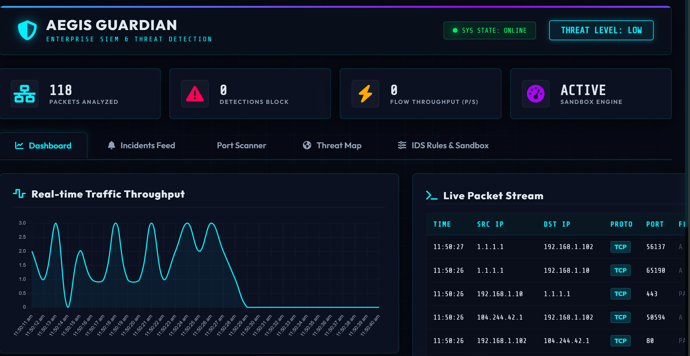

# Aegis Guardian

Aegis Guardian is a Security Information and Event Management (SIEM) dashboard developed to demonstrate real-time network monitoring, intrusion detection, vulnerability assessment, and security event visualization.

The application combines signature-based detection, behavioral analysis, vulnerability scanning, and live event streaming to simulate the workflow of a Security Operations Center (SOC).

## Features

### Intrusion Detection

- Signature-based detection for:
  - SQL Injection (SQLi)
  - Cross-Site Scripting (XSS)
  - Directory Traversal
  - Malicious DNS Queries

- Behavioral detection for:
  - Distributed Denial of Service (DDoS)
  - Port Scanning
  - SSH/FTP Brute Force Attempts

### Vulnerability Scanner

- Multi-threaded port scanning
- Banner grabbing
- Service identification
- CVE mapping
- CVSS severity classification
- Mitigation recommendations

### Dashboard

- Live packet monitoring
- Real-time security alerts
- Network traffic visualization
- Protocol statistics
- Threat severity analytics
- Global threat map
- Interactive attack simulator

### IDS Configuration

- Configurable detection thresholds
- Signature rule management
- Dynamic configuration updates

---

## Technology Stack

### Frontend

- HTML5
- CSS3
- JavaScript
- Chart.js

### Backend

- Python
- Flask
- Flask-CORS
- Server-Sent Events (SSE)
- Multithreading

---

## Project Structure

```
aegis-siem-dashboard/
│
├── frontend/
│   ├── index.html
│   ├── style.css
│   └── dashboard.js
│
├── backend/
│   ├── app.py
│   ├── threat_engine.py
│   ├── vuln_scanner.py
│   └── verify_backend.py
│
├── assets/
│   └── screenshots/
│       ├── Dashboard.png
│       ├── Alert Classification and Active Protocols.png
│       ├── DDoS Attack Triggered.png
│       ├── IDS Rules & Sandbox.png
│       ├── Incidents Feed.png
│       ├── Port Scanner.png
│       ├── Threat Map.png
│       └── Vulnerability Report.png
│
└── README.md
```

---

## Getting Started

### Clone the repository

```bash
git clone  https://github.com/Meghana2024/aegis-siem-dashboard.git
```

### Install dependencies

```bash
cd backend
pip install flask flask-cors
```

### Start the backend

```bash
python app.py
```

The backend will be available at:

```
http://127.0.0.1:5000
```

### Launch the frontend

Open the following file in your browser:

```
frontend/index.html
```

---

## Screenshots

### Dashboard

Provides an overview of the system, including real-time traffic statistics, network activity, and live packet monitoring.



---

### Alert Classification and Active Protocols

Displays the distribution of detected security alerts and active network protocols monitored by the SIEM dashboard.


---

### Incidents Feed

Shows detected security events with their severity, timestamp, and threat information.


---

### Port Scanner

Displays the results of the vulnerability scan, including open ports, running services, and service banners.


---

### Vulnerability Report

Lists identified vulnerabilities along with their severity, associated CVEs, and mitigation recommendations.


---

### Threat Map

Visualizes simulated attack sources and incoming threat activity in real time.


---

### IDS Rules & Sandbox

Provides controls for configuring IDS detection thresholds and triggering simulated cyberattacks.


---

### DDoS Attack Triggered

Shows the dashboard after a simulated DDoS attack, highlighting increased traffic and critical threat detection.


---

## Cybersecurity Concepts Demonstrated

- Security Information and Event Management (SIEM)
- Intrusion Detection System (IDS)
- Signature-Based Detection
- Behavioral Threat Analysis
- SQL Injection Detection
- Cross-Site Scripting Detection
- Directory Traversal Detection
- Distributed Denial of Service (DDoS) Detection
- Port Scan Detection
- SSH/FTP Brute Force Detection
- Vulnerability Assessment
- Banner Grabbing
- CVE Mapping
- CVSS Risk Scoring
- Server-Sent Events (SSE)
- Multithreaded Processing

---

## Future Enhancements

- Integration with live packet capture
- Threat intelligence feed integration
- User authentication
- PDF report generation
- SIEM log ingestion
- Elasticsearch support

---

## License

This project was developed for academic and educational purposes.
